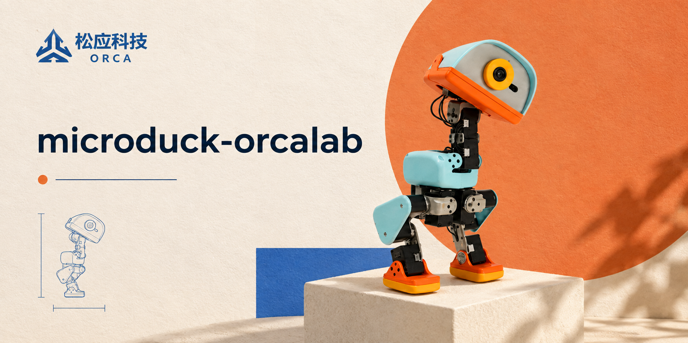

<div align="center">
  
</div>

<div align="center">
  <h1>Microduck · OrcaLab</h1>
  <p>
    <a href="https://www.python.org/"></a>
    <a href="https://openverse-orca.github.io/microduck-orcalab/"></a>
    <a href="LICENSE"></a>
  </p>
  <p><em>🚀 无需浏览器、无需训练代码 —— 一个脚本，在 OrcaLab 本地玩转 14 自由度的鸭子机器人 Microduck。</em></p>
</div>

---

## ✨ 简介

**Microduck** 是一台 **14 自由度的鸭子形机器人**（两腿 + 脖子 + 头）。本项目旨在让你只用一个脚本就能在[OrcaLab](https://github.com/openverse-orca/orcalab) 平台本地试玩 Microduck。


<!-- 把录制好的 example.gif 放到 asset/ 下（同名覆盖即可），下面的图会自动显示 -->
<p align="center">
  
</p>


## 🚀 快速开始

### 🛠️ 安装

需要 **Python ≥ 3.12**。物理 + 策略推理建议用 GPU（默认 `--device cuda:0`），纯 CPU 也能跑，
但会慢不少。


```bash
# 创建并激活虚拟环境（conda / venv 均可，这里以 conda 为例）
conda create -n microduck python=3.12 -y && conda activate microduck

# 安装核心依赖
pip install -e .
``` 


### 资产下载

登录资产库，搜索并订阅机器人模型资产：`robot_allcollisions_colour`。

### 启动引擎

在命令行输入 `orcalab` 启动引擎，并在 OrcaLab 中打开场景：
点击左上角 **开启仿真 → 其他选项 → 手动启动**。

### 单策略试玩
```bash
bash scripts/run_duck.sh
```

### 多策略试玩
```bash
bash scripts/run_duck_multi_policy.sh
```

运行后即可用键盘实时切换策略：

```text
════════════════════════════════════════════════════════════════
  Microduck 多策略键盘控制（50 Hz，随时切换）
════════════════════════════════════════════════════════════════
  方向（转向当前步态；坐姿时按方向键会先站起）：
    ↑ / w  前进      ↓ / s  后退
    ← / a  左转      → / d  右转
    0       停止（速度归零）

  快速切换策略（一次性动作仅在「行走」时触发）：
    1  坐下          2  站起
    3  翻滚          4  左脚踢      5  右脚踢
    6  捡拾          7  起立恢复
    8  复位到站姿

  q / Ctrl-C  退出
════════════════════════════════════════════════════════════════
```

### 参数说明

| 参数 | 含义 | 默认 |
|---|---|---|
| `--steps` | 总控制步数（每步 0.02 s） | `2000` |
| `--log-every` | 每隔多少步打印一次状态 | `100` |
| `--num-envs` | 并行环境数（GPU 批量） | `1` |
| `--device` | 推理 / 物理所在设备 | `cuda:0` |
| `--lin-vel-x` | 指令前向速度（m/s） | `0.25` |
| `--lin-vel-y` | 指令侧向速度（m/s） | `0` |
| `--ang-vel-z` | 指令转向角速度（rad/s） | `0` |
| `--onnx` | 策略文件路径 | `policy/BEST_alpha_walking.onnx` |
| `--realtime` | 按真实时间节流（否则跑得飞快） | 关 |

`--orcalab` 可视化相关参数：

| 参数 | 含义 | 默认 |
|---|---|---|
| `--orca-addr` | OrcaLab gRPC 服务地址 | `localhost:50051` |
| `--asset-path` | OrcaStudio 中鸭子的 prefab 路径（`--orcalab` 必填） | 空 |
| `--agent-prefix` | 代理名前缀 | `duck` |
| `--spacing` | 多环境网格间距（m） | `1.0` |
| `--render-fps` | 渲染帧率 | `30` |


## 🎮 策略一览

`policy/` 下的 ONNX 共享同一套 61 维观测 / 14 维动作接口，均来自[官方策略库](https://huggingface.co/pollen-robotics/microduck-policies/tree/main)。

| 策略 | ONNX 文件 | 指令约定 |
|:---|:---|:---|
| 行走 | `BEST_alpha_walking.onnx` | twist `[vx, vy, wz]` |
| 坐 / 站 | `BEST_alpha_sitstand.onnx` | `cmd[0]`：0=站，1=坐 |
| 翻滚 | `roulade.onnx` | 相位编码 `[cos φ, sin φ, 0]` |
| 捡拾 | `alpha_ground_pick.onnx` | 相位编码 `[cos φ, sin φ, 0]` |
| 左脚踢 | `ball_kick_left.onnx` | twist（默认） |
| 右脚踢 | `ball_kick_right.onnx` | twist（默认） |
| 起立恢复 | `BEST_alpha_stand.onnx` | twist（默认） |

> 其它 `policy/*.onnx`（如 `BEST_roller*.onnx`、`happy_hop.onnx` 等翻滚 / 跳跃变体）同样适用：
> 放入 `policy/` 后改 `run_duck.py` 里的默认路径、按上表填指令即可。默认策略是
> `BEST_alpha_walking.onnx`（行走）。

## 📂 项目结构

```text
microduck-orcalab/
├── scripts/                     # 本地控制脚本
│   ├── run_duck.py              # 单策略控制（命令行参数控制步态）
│   ├── run_duck.sh              # 单策略启动脚本（已配好 OrcaLab 参数）
│   ├── run_duck_multi_policy.py # 多策略键盘实时切换
│   └── run_duck_multi_policy.sh # 多策略启动脚本
├── policy/                      # ONNX 策略文件（61 维观测 / 14 维动作）
├── robot/                       # 机器人模型与网格（XML / STL 部件）
├── docs/                        # 文档源码（mkdocs 站点）
├── third_party/                 # 上游 microduck_rl 子模块
├── vendor/                      # 上游 OrcaLab / RSL-RL 运行时
├── asset/                       # README 用到的图片素材
├── mkdocs.yml                   # 文档站点配置
└── pyproject.toml               # 依赖与工具（ruff）配置
```

## 🧠 模型训练
参考官方模型训练仓库：[microduck_rl](https://github.com/pollen-robotics/microduck_rl)


## 🤝 贡献
欢迎提 issue 与 PR。